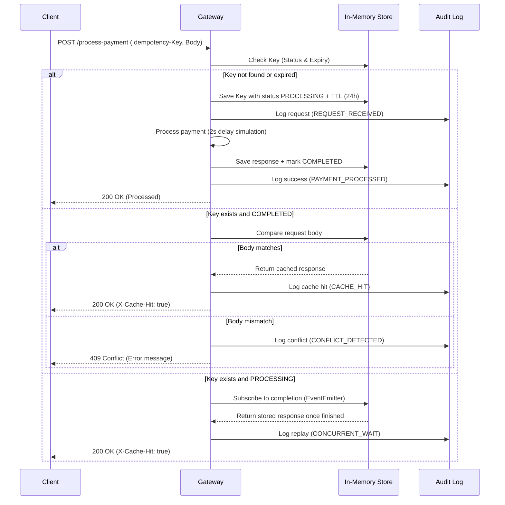

# FinSafe Idempotency Gateway (The "Pay-Once" Protocol)

A high-performance, production-ready Idempotency Layer built with Node.js and Express for FinSafe Transactions Ltd. This middleware ensures that payment requests are processed exactly once, regardless of network retries or concurrent requests.

##  Architecture Diagram



##  Features & Logic

- **Strict Idempotency**: Guarantees a single execution for any unique `Idempotency-Key`.
- **Concurrency Handling**: Uses an Event-Driven promise queue to manage "in-flight" requests, preventing race conditions.
- **Payload Integrity**: Detects and rejects requests where the same key is used with different transaction data (409 Conflict).
- **Request Validation**: Validates amount (must be positive) and currency (ISO 3-letter code) before processing.
- **Swagger Documentation**: Interactive API testing suite available at `/api-docs`.

## Developer's Choice (Extra Features)

1.  **TTL (Time-To-Live) Expiration**:
    - **Mechanism**: Every idempotency key is assigned a 24-hour expiration timestamp.
    - **Purpose**: Prevents memory bloat in the in-memory store and complies with fintech data retention best practices where keys are typically valid for a limited window.
2.  **Audit Trail Logging**:
    - **Mechanism**: Every lifecycle event (Request, Success, Conflict, Cache Hit) is logged with a timestamp.
    - **Purpose**: Provides full transparency for security audits and simplifies troubleshooting for failed customer transactions.

## Setup & Installation

1.  **Clone the repository**:
    ```bash
    git clone https://github.com/Aline-CROIRE/AmaliTech-DEG-Project-based-challenges.git
    cd backend
    cd idempotency-gateway
    ```

2.  **Install dependencies**:
    ```bash
    npm install
    ```

3.  **Start the server**:
    ```bash
    npm start
    ```

## API Documentation

### 1. Process Payment
**Endpoint**: `POST /process-payment`  
**Header**: `Idempotency-Key: <unique-string>`

**Request Body**:
```json
{
  "amount": 100,
  "currency": "FRW"
}
```

**Successful Response (First Time)**:
- **Status**: `200 OK`
- **Body**: `{"status": "success", "message": "Charged 100 FRW"}`

**Successful Response (Duplicate)**:
- **Status**: `200 OK`
- **Header**: `X-Cache-Hit: true`
- **Body**: `{"status": "success", "message": "Charged 100 FRW"}`

### 2. Audit Logs
**Endpoint**: `GET /audit-logs`  
**Description**: Returns a list of all system interactions and idempotency events.

### 3. Health Check
**Endpoint**: `GET /health`  
**Description**: Returns server status.

### 4. Interactive Docs
**URL**: `http://localhost:3000/api-docs`

##  Testing Guide

### Test User Story 1: Happy Path
```bash
curl -i -X POST http://localhost:3000/process-payment \
-H "Content-Type: application/json" \
-H "Idempotency-Key: key-001" \
-d '{"amount": 100, "currency": "FRW"}'
```

### Test User Story 2: Duplicate Request
Run the command above a second time. You will notice:
1. The response is **instant**.
2. The header `X-Cache-Hit: true` is present.

### Test User Story 3: Conflict (Same Key, Different Body)
```bash
curl -i -X POST http://localhost:3000/process-payment \
-H "Content-Type: application/json" \
-H "Idempotency-Key: key-001" \
-d '{"amount": 999, "currency": "USD"}'
```
**Expected**: `409 Conflict`.

### Test Concurrency: Race Condition
Open two terminals and run the "Happy Path" command simultaneously. Terminal 2 will wait for Terminal 1 to finish and then return the cached result.

## Design Decisions

- **Node.js & Express**: Chosen for non-blocking I/O, ideal for handling high-concurrency payment gateways.
- **In-Memory Map**: Used for high-speed key-value lookups.
- **EventEmitter**: Utilized to handle concurrent "In-Flight" requests without blocking the Node.js event loop.
- **MVC Structure**: Organized into Controllers, Services, and Middleware for scalability.
```