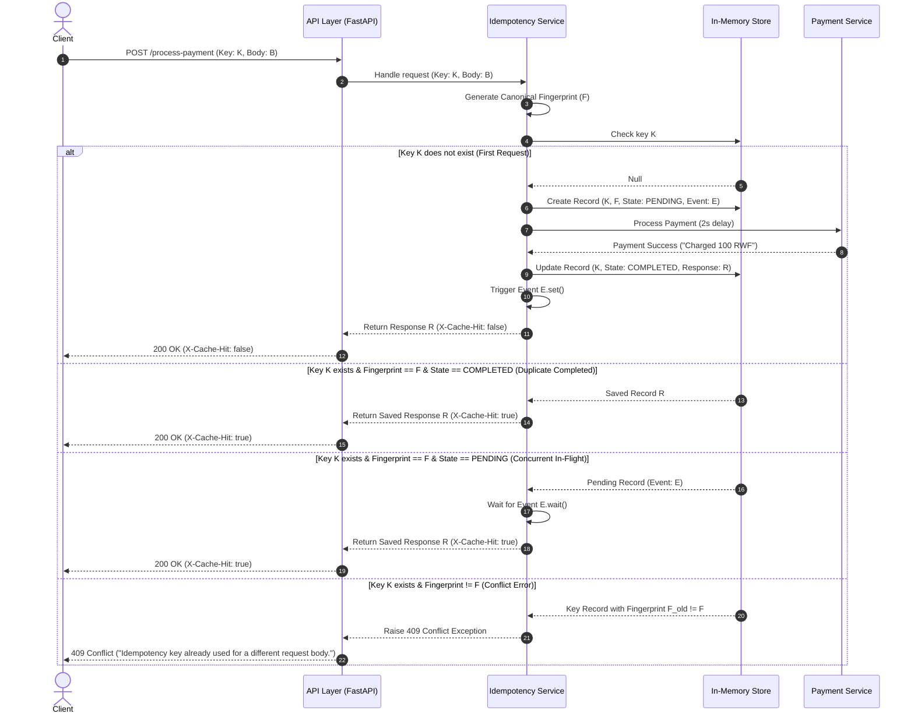

# FinSafe Idempotency Gateway ("Pay-Once" Protocol)

[](https://www.python.org/)
[](https://fastapi.tiangolo.com/)
[](https://docs.pytest.org/)

An enterprise-grade, concurrency-safe Idempotency Layer built with **Python** and **FastAPI**. Designed for fintech payment gateways to guarantee **exactly-once execution** of payment transactions despite network retries, duplicate submissions, or simultaneous in-flight requests.

---

## 1. Project Overview

In payment processing systems, network latency or timeouts cause e-commerce clients to automatically retry sending payment requests. Without an idempotency protection layer, these retries cause **double-charging**, leading to loss of customer trust and compliance penalties.

**FinSafe Idempotency Gateway** acts as an intermediary layer that intercepts payment requests:
- **First Request**: Executes payment logic and caches the resulting response.
- **Duplicate Request**: Intercepts matching keys, skips payment execution, and returns the cached response instantly with header `X-Cache-Hit: true`.
- **Payload Conflict**: Detects key reuse with modified payloads and rejects them with `409 Conflict`.
- **Concurrent Requests**: Synchronizes in-flight requests on the same key using `asyncio.Event` primitives so payment logic executes **exactly once**.

---

## 2. Features

- **Exactly-Once Processing**: Simulates external payment gateway processing with guaranteed idempotency.
- **Canonical Payload Fingerprinting**: Uses sorted SHA-256 JSON hashing to accurately detect modified bodies regardless of key ordering or whitespace.
- **In-Flight Concurrency Protection**: Blocks duplicate simultaneous requests using per-key `asyncio.Event` objects until the primary request finishes.
- **Response Caching**: Saves status codes and response bodies, returning `X-Cache-Hit: true` on cached replays.
- **Developer's Choice (Key TTL Expiration)**: Automatically expires cached keys after a configurable Time-To-Live (default 24 hours) to prevent memory leak growth in production.
- **Interactive OpenAPI / Swagger Documentation**: Available out-of-the-box at `/docs`.

---

## 3. Architecture & Data Flow


```mermaid
sequenceDiagram
    autonumber
    actor Client
    participant API as API Layer (FastAPI)
    participant Service as Idempotency Service
    participant Store as In-Memory Store
    participant Payment as Payment Service

    Client->>API: POST /process-payment (Key: K, Body: B)
    API->>Service: Handle request (Key: K, Body: B)
    Service->>Service: Generate Canonical Fingerprint (F)
    Service->>Store: Check key K

    alt Key K does not exist (First Request)
        Store-->>Service: Null
        Service->>Store: Create Record (K, F, State: PENDING, Event: E)
        Service->>Payment: Process Payment (2s delay)
        Payment-->>Service: Payment Success ("Charged 100 RWF")
        Service->>Store: Update Record (K, State: COMPLETED, Response: R)
        Service->>Service: Trigger Event E.set()
        Service-->>API: Return Response R (X-Cache-Hit: false)
        API-->>Client: 200 OK (X-Cache-Hit: false)

    else Key K exists & Fingerprint == F & State == COMPLETED (Duplicate Completed)
        Store-->>Service: Saved Record R
        Service-->>API: Return Saved Response R (X-Cache-Hit: true)
        API-->>Client: 200 OK (X-Cache-Hit: true)

    else Key K exists & Fingerprint == F & State == PENDING (Concurrent In-Flight)
        Store-->>Service: Pending Record (Event: E)
        Service->>Service: Wait for Event E.wait()
        Service-->>API: Return Saved Response R (X-Cache-Hit: true)
        API-->>Client: 200 OK (X-Cache-Hit: true)

    else Key K exists & Fingerprint != F (Conflict Error)
        Store-->>Service: Key Record with Fingerprint F_old != F
        Service-->>API: Raise 409 Conflict Exception
        API-->>Client: 409 Conflict ("Idempotency key already used for a different request body.")
    end
```

---

## 4. Technology Stack

- **Language**: Python 3.10+
- **Framework**: FastAPI
- **Data Validation**: Pydantic v2
- **ASGI Server**: Uvicorn
- **Testing Framework**: pytest & pytest-asyncio
- **HTTP Client**: httpx

---

## 5. Project Structure

```text
idempotency-gateway/
├── app/
│   ├── __init__.py
│   ├── main.py                  # FastAPI initialization & route registration
│   ├── api/
│   │   ├── __init__.py
│   │   └── payment_routes.py    # HTTP endpoints & OpenAPI schemas
│   ├── core/
│   │   ├── __init__.py
│   │   └── exceptions.py        # Custom domain exceptions
│   ├── schemas/
│   │   ├── __init__.py
│   │   └── payment.py           # Pydantic request/response models
│   ├── services/
│   │   ├── __init__.py
│   │   ├── idempotency_service.py # Core fingerprinting & lock coordination
│   │   └── payment_service.py   # Payment simulation logic
│   └── storage/
│       ├── __init__.py
│       └── idempotency_store.py # In-memory thread-safe store with TTL
├── tests/
│   ├── __init__.py
│   ├── test_payment.py          # Endpoint and validation tests
│   ├── test_idempotency.py      # Cache hit, conflict, and TTL tests
│   └── test_concurrency.py      # Multi-request in-flight concurrency tests
├── .gitignore
├── requirements.txt
└── README.md
```

---

## 6. Local Setup & Execution

### Prerequisites
- Python 3.10 or higher
- Git

### Installation Steps

1. **Clone the repository**:
   ```bash
   git clone https://github.com/YOUR-USERNAME/Idempotency-Gateway.git
   cd Idempotency-Gateway
   ```

2. **Create and activate a virtual environment**:

   - **Windows PowerShell**:
     ```powershell
     python -m venv venv
     Set-ExecutionPolicy -ExecutionPolicy RemoteSigned -Scope Process -Force
     .\venv\Scripts\Activate.ps1
     ```

   - **Linux / macOS**:
     ```bash
     python3 -m venv venv
     source venv/bin/activate
     ```

3. **Install dependencies**:
   ```bash
   pip install --upgrade pip
   pip install -r requirements.txt
   ```

4. **Run the server**:
   ```bash
   uvicorn app.main:app --reload
   ```

5. **Access Interactive Documentation**:
   - Swagger UI: `http://127.0.0.1:8000/docs`
   - ReDoc: `http://127.0.0.1:8000/redoc`

---

## 7. API Documentation

### `POST /process-payment`

Processes a payment transaction protected by idempotency checks.

#### Request Headers
| Header Name | Type | Required | Description | Example |
| :--- | :--- | :--- | :--- | :--- |
| `Idempotency-Key` | String | Yes | Unique identifier for transaction attempt | `req_key_8832` |
| `Content-Type` | String | Yes | Content format | `application/json` |

#### Request Body
```json
{
  "amount": 100.00,
  "currency": "RWF"
}
```

#### Successful Response (`200 OK`)
**Response Headers**: `X-Cache-Hit: false` (First request) or `X-Cache-Hit: true` (Cached replay)
```json
{
  "message": "Charged 100 RWF",
  "amount": 100.0,
  "currency": "RWF",
  "transaction_id": "tx_a1b2c3d4e5",
  "status": "SUCCESS"
}
```

#### Payload Conflict Response (`409 Conflict`)
Occurs when reusing an existing key with a modified body.
```json
{
  "detail": "Idempotency key already used for a different request body."
}
```

#### cURL Example
```bash
curl -X POST "http://127.0.0.1:8000/process-payment" \
     -H "Content-Type: application/json" \
     -H "Idempotency-Key: unique-key-001" \
     -d '{"amount": 100.00, "currency": "RWF"}'
```

---

## 8. Running Automated Tests

Run the full test suite with verbose output:

```bash
pytest -v
```

To run individual test files:
```bash
pytest tests/test_payment.py -v
pytest tests/test_idempotency.py -v
pytest tests/test_concurrency.py -v
```

---

## 9. Concurrency & In-Flight Request Handling

When simultaneous requests with the same key arrive at the exact same millisecond:
1. **Request A** acquires the key, creates an `IdempotencyRecord` in `PENDING` state with a fresh `asyncio.Event()`, and begins payment execution.
2. **Request B** arrives, detects that state is `PENDING`, and calls `await record.event.wait()`. This suspends Request B cleanly without blocking the application event loop.
3. Once **Request A** finishes payment processing, it writes the result, updates state to `COMPLETED`, and invokes `event.set()`.
4. **Request B** instantly wakes up, reads the saved response, and returns with header `X-Cache-Hit: true`.

---

## 10. Developer's Choice: Key TTL Expiration

### Problem
In-memory key stores continuously grow as transactions arrive. Over time, stale idempotency keys consume RAM, eventually leading to server memory exhaustion.

### Solution
We implemented a **Time-To-Live (TTL)** key expiration strategy (`InMemoryIdempotencyStore(ttl_seconds=86400)`).
- Every record stores a `created_at` timestamp.
- Upon lookup, if `(now - created_at) > ttl_seconds`, the store automatically purges the expired key and treats it as a brand-new key attempt.
- This balances long-term data integrity with RAM safety.

---

## 11. Limitations & Production Improvements

### Current Limitations
- **In-Memory Volatility**: If the server restarts, stored keys in RAM are lost.
- **Single Instance Bound**: Works for single-node deployments. Multiple server instances behind a load balancer would need a shared store.

### Future Improvements
1. **Redis Enterprise Backend**: Replace `InMemoryIdempotencyStore` with Redis utilizing `SET key value NX EX ttl` for distributed synchronization across multi-node clusters.
2. **Database Persistence**: Store key fingerprints in PostgreSQL alongside primary billing records.
3. **Client-Scoped Keys**: Bind keys to API client IDs (`Client-ID + Idempotency-Key`) to prevent key collisions between different merchants.
```

---

